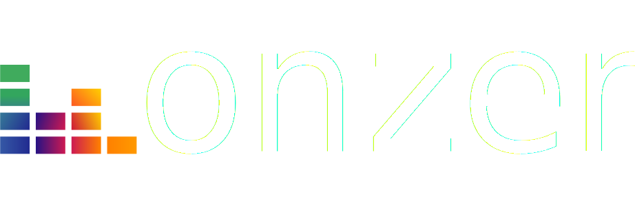

<p align="center">
  <a href="https://heinezo.github.io" target="_blank"></a>
 </p>


#  Onzer

Onzer est une plateforme musicale qui permet de répertorier des musiques et des playlists. L'application est disponible avec des musiques et des playlists préconfigurées, que vous pourrez modifier ou bien créé les vôtre.

## 🕺 Démonstration

🚧 En cours

## 🛠️ Installation

Une fois le projet cloné, installez toutes les dépendances
```bash
  npm i
```

### En local
Pour faire fonctionner l'application en local, installez le client [MongoDB](https://www.mongodb.com/try/download/community) \
Une fois l'installation terminée, le service MongoDB devrait tourné sur le port **27017** \ 

C'est tout ✅

### Avec MongoDB Atlas
- Créez un compte [MongoDB Atlas](https://www.mongodb.com/cloud/atlas/register) 
- Une fois sur l'interface d'Atlas, cliquez sur le bouton **Database**
- Dans la section **Database Deployments**, appuyez sur **Connect** pour la base de donnée que vous souhaitez utiliser
- Choisissez le mode de connection standart et créez un utilisateur
- A l'étape **Choose a connection method**, cliquez sur **Connect your application**
- Remplacez *<password>* par le mot de passe que vous aviez choisi pour votre utilisateur et *<myFirstDatabase>* par **onzer**
Vous n'avez plus qu'à récupérer votre lien de connexion à la base qui devrait ressembler à ça avec des valeurs différentes: [mongodb://[username:password@]host1[:port1][,...hostN[:portN]][/[defaultauthdb][?options]]](mongodb://[username:password@]host1[:port1][,...hostN[:portN]][/[defaultauthdb][?options]]) 

Changez le lien de connexion de la base de donnée dans le fichier **index.js** situé à cette adresse: `/lib/mongo/index.js`
 

## 👨‍💻 Utilisation

Une fois que vous avez procédé à l'installation, il ne vous reste plus qu'à lancer l'application. \
Pour ce faire, executez la commande suivante

```bash
  npm run dev
```

L'interface de l'application sera disponible à l'addresse [http://localhost:3000](http://localhost:3000)


## ✨ Todo list
- [x]  Faire la connexion entre MongoDB et NextJS  
- [x]  Créer des données de base pour les musiques
- [x]  Créer des données de base pour les playlists
- [x]  Lister toutes les musiques de la base de données
- [x]  Récupérer les données d'une musique
- [x]  Ajouter une musique
- [x]  Modifier une musique
- [x]  Supprimer une musique
- [x]  Lister toutes les playlists
- [x]  Récupérer les données d'une playlist
- [ ]  Ajouter une musique à une playlist
- [x]  Créer une playlist
- [ ]  Modifier une playlist
- [ ]  Supprimer une playlist
- [ ]  Récupérer l'image d'une musique automatiquement en fonction de son titre
- [ ]  Rechercher une musique ou une playlist à partir de critères


---
Imaginé et développé par [@heinezo](https://github.com/HeineZo) & [@elucas0](https://github.com/elucas0)

---

